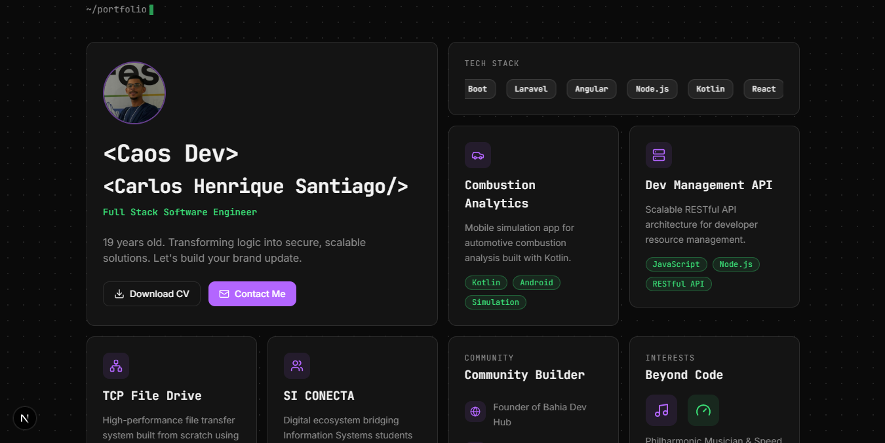

# Portfolio - Carlos Henrique (Caos)

> "Transforming logic into secure, scalable solutions."

Portfólio pessoal em formato **Bento Grid** com tema Dark/Cyber, construído com **Next.js 15+**, **Tailwind CSS** e **Framer Motion**. Focado em performance, design responsivo e identidade visual única.

 
---

## ⚡ Visão Geral

Este é um *Single Page Application* (SPA) que organiza minhas múltiplas facetas (Desenvolvedor, Músico, Mentor) em um grid interativo.

### 🧩 Os Blocos (Bento Grid)

| Card | Descrição |
| :--- | :--- |
| **Hero & Bio** | Apresentação com foto, efeito de digitação (Typewriter) e Download de CV. |
| **Tech Stack** | *Infinite Marquee* (rolagem infinita) com ícones de Java, Spring, Angular, etc. |
| **Projects** | Exibição dinâmica dos meus principais repositórios (Kotlin, Java, Web). |
| **Real-time GPS** | Mapa estilizado (Dark Mode) com relógio em tempo real (UTC-3 Bahia). |
| **Vibe / Music** | Player estilo Spotify incorporado com playlist de foco/coding. |
| **Community** | Métricas de impacto: Bahia Dev Hub, Mentorias na UNEX e Eventos. |
| **GitHub Stats** | Gráfico de contribuições (Heatmap) gerado via Client-Side. |
| **Contact** | Links diretos para Email, LinkedIn e GitHub. |

---

## 🛠️ Tech Stack

O projeto utiliza o que há de mais moderno no ecossistema React:

| Categoria | Tecnologia | Uso |
| :--- | :--- | :--- |
| **Core** | [Next.js 15](https://nextjs.org/) | App Router, Server Components e Otimização de Imagens. |
| **UI** | [React 19](https://react.dev/) | Biblioteca de interface. |
| **Estilo** | [Tailwind CSS](https://tailwindcss.com/) | Estilização Utility-first e Design System. |
| **Animação** | [Framer Motion](https://www.framer.com/motion/) | Transições de entrada, hover e efeitos de física. |
| **Ícones** | [Lucide React](https://lucide.dev/) | Ícones leves e consistentes. |
| **Fontes** | Inter & JetBrains Mono | Tipografia moderna e de código (Google Fonts). |

---


## 📂 Estrutura do Projeto

```bash
/
├── app/
│   ├── globals.css          # Variáveis CSS, Cores Neon e Reset
│   ├── layout.tsx           # Configuração de Fontes e Metadados SEO
│   └── page.tsx             # Montagem do Bento Grid principal
│
├── components/
│   ├── bento-card.tsx       # Componente Base (Vidro/Glassmorphism + Bordas)
│   ├── hero-card.tsx        # Bio + Foto + CV Download
│   ├── tech-stack-card.tsx  # Carrossel Infinito de Tecnologias
│   ├── map-card.tsx         # Google Maps Dark Mode + Relógio JS
│   ├── music-card.tsx       # Iframe do Spotify estilizado
│   ├── github-card.tsx      # Lógica de renderização do Heatmap
│   └── ... (outros cards)
│
├── public/
│   ├── CV_Carlos_Santiago.pdf        # Arquivo de Currículo para download
│   ├── profile.png          # Foto de perfil otimizada
│   └── ...
```

## 💻 Instalação e Execução
Pré-requisitos
Node.js 18+ instalado.

Passo a Passo
Bash 
```
# 1. Clone o repositório
git clone [https://github.com/CarlosH-Santiago/portfolio-v1.git](https://github.com/CarlosH-Santiago/portfolio-v1.git)

# 2. Entre na pasta
cd portfolio-v1

# 3. Instale as dependências (pode usar npm ou pnpm)
npm install
# ou
pnpm install

# 4. Rode o servidor local
npm run dev

# 5. Acesse no navegador
http://localhost:3000

```
🎨 Personalização (Como editar)
Conteúdo: Todos os textos estão nos arquivos dentro da pasta /components.

Imagens: Substitua os arquivos profile.jpg na pasta /public.

CV: Substitua o arquivo cv_carlos.pdf na pasta /public (mantenha o nome ou atualize o link no hero-card.tsx).

Cores: Ajuste as variáveis :root no arquivo app/globals.css para mudar o tema de cores (Roxo/Verde).

☁️ Deploy
O deploy é feito automaticamente via Vercel:

Desenvolvido com ☕ por Carlos Henrique (Caos).